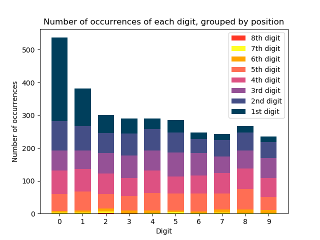

# Automated Meter Reading

This walk-through of an attempt to train Yolo to identify meter reading digits, and thus provide an automated meter reading solution, inspired by this paper: [https://arxiv.org/pdf/1902.09600.pdf][1] ([\[1\]][1]).

Unlike the original paper we assume that the supplied image has been cropped (either manually, or automatically) to show only the counter with some additional margin. This could be achieved through an app by prompting the user to frame the counter within a box or - as in the above paper - through a prior application of Yolo.

## Why Yolo?

From initial manual testing (Python-tesseract, Amazon Rekognition, Amazon Textract) had very poor performance. Standard OCR techniques appear to struggle with meter readings - most likely because of numbers being rotated, pictures taken at an angle or the presence of segmented digits.

In Convolutional Neural Networks for Automatic Meter Reading, the authors demonstrated promising results. In particular with Yolo-based model. Multi-Task and CRNN models were also tested, and performed well but not as well; they are also subject to inherit bias in meter reading counters which tend to start with lower numbers (i.e. 0 and 1) due to the nature in which they increment.

## Proposal

Train the model to identify 10 classes, the digits 0-9. By identifying the digits, and assuming a left-to-right display we can extract the reading value.

## Data

Data was sourced initially from images of meter counters in the public domain. These images were then manually annotated.

As previously noted the data, the nature of meter counters means that there is an overwhelming bias in 0s and 1s in the first digit. For later positions the digits are far more evenly distributed. As seen below

Note unlike in [\[1\]][1] the number of the digits in each counter varied between 4 and 7.

In [\[1\]][1] the authors countered the bias distribution of digits through data augmentation. This improved the Multi-Task and CRNN models which do not segment the digits, and thus more susceptible to the bias. The Yolo-based model saw a more modest ~3% improvement. Initially we will not apply data augmentation techniques.

## References

1. [Convolutional Neural Networks for Automatic Meter Reading][1] by Rayson Larocaa, Victor Barrosoa, Matheus A. Dinizb, Gabriel R. Gonc ̧alvesb,William Robson Schwartzb, David Menotti

[1]: https://arxiv.org/pdf/1902.09600.pdf

